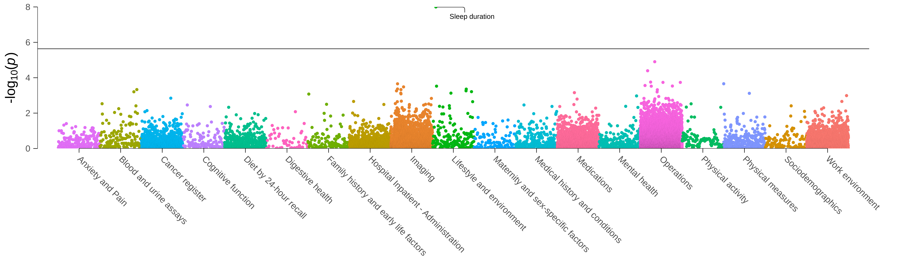
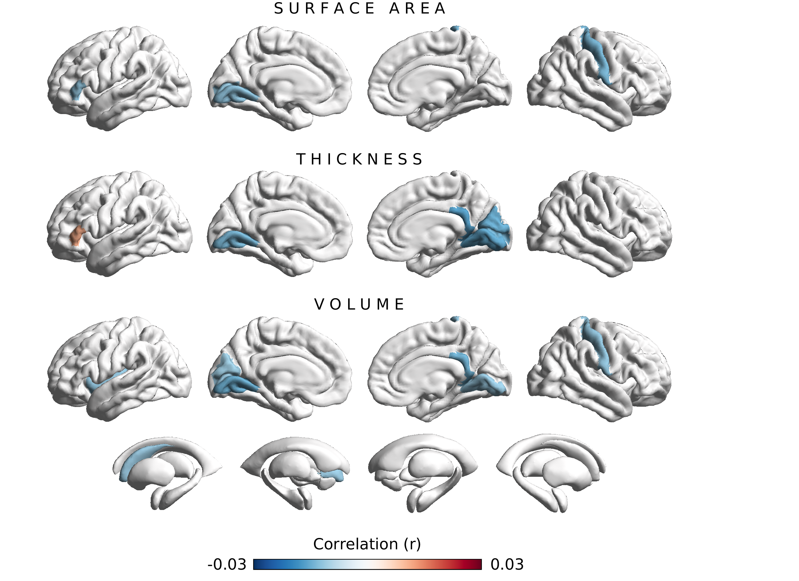
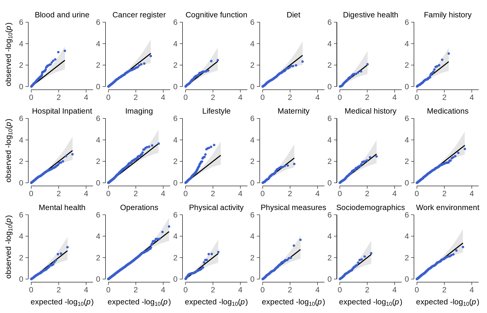
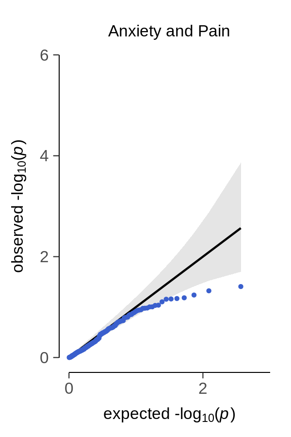

# Phenome-wide association study of pain- and anxiety-linked endocannabinoid gene variation FAAH C385A
[](https://app.codacy.com?utm_source=gh&utm_medium=referral&utm_content=&utm_campaign=Badge_grade)
[](https://www.gnu.org/licenses/gpl-3.0)
[](https://doi.org/10.1101/2023.12.26.23300533)

This repository contains the analysis scripts to reproduce the results presented in our PuG 2024 poster contribution entitled "Phenome-wide association study of pain- and anxiety-linked endocannabinoid gene variation FAAH C385A". The individual-level data incorporated in this work have been obtained from the UK Biobank resource (https://www.ukbiobank.ac.uk/) under application number 423032.

## Folder structure
[code/](code/) - contains preparation files, functions, and analysis scripts<br>
[envs/](envs/) - contains conda .yml files to recreate our environments<br>
[results/](results/) - contains result files (individual-level results are not provided due to data privacy policies)<br>
[run.sh](run.mri.sh) - main analysis file for FAAH C385A phenome-wide associations<br>


## Software requirements
Analyses were run on Debian GNU/Linux 11 (bullseye) with kernel version 5.10.0-23-amd64. Scripts to install the required bioinformatic tools are provided in folder [code/prepare/](code/prepare/). We recommend [mamba](https://mamba.readthedocs.io/en/latest/installation/mamba-installation.html) for installing conda environments. The following tools are required to reproduce our results:

- [PLINK](https://www.cog-genomics.org/plink/) v1.90b6.8 64-bit
- [PHESANT](https://github.com/MRCIEU/PHESANT)


## Download
Navigate to your preferred local folder and clone this repository via the following commands:
```
git clone https://github.com/pjawinski/ukb_faah
cd ukb_faah
```

- please see the primary analysis file [run.sh](run.sh) for a step-by-step guide through the individual analysis procedures


<br>


## Results at a glance

**Fig. 1**	Results of the phenome-wide association analysis for FAAH C385A in up to 340,863 unrelated white-British ancestry UK Biobank individuals. The solid horizontal line indicates the Bonferroni-adjusted level of significance (p<2.3e-06), correcting for 21,624 tested associations.

<br><br><br>



**Fig. 2**	Associations between FAAH C385A and 220 Freesurfer brain structure variables. Colors reflect the strength and direction of partial product-moment correlations (sex, age, age2, sex x age, sex x age2, assessment center, genotyping array, and the first 10 genetic principal components served as covariates). Brain regions with associations achieving nominal significance (p < 0.05) are colored in red and blue. The effect allele is A. None of the observed associations remained significant after multiple-testing correction.

<br><br><br>



**Fig. 3**	Quantile-quantile plots showing the observed p-values from the phenome-scan vs. the expected p-values under the null hypothesis of no effect. Left-deflations from the solid diagonal line are interpreted as ‘stronger evidence than expected under the null'.

<br><br><br>



**Fig. 4**	Quantile-quantile plots showing the observed p-values from the phenome-scan vs. the expected p-values under the null hypothesis of no effect for category 'Anxiety and Pain'. Left-deflations from the solid diagonal line are interpreted as ‘stronger evidence than expected under the null'. 
